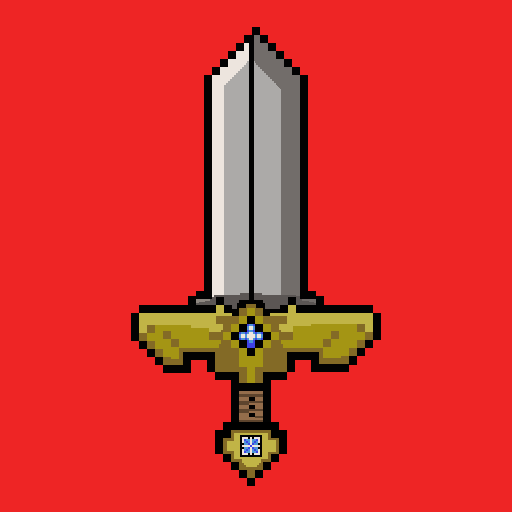

# HeroXQuest

  

# Introduction

In this repository you can find my third project built with Python and JSON. **HeroXQuest** is a Quiz Battle game where, in order to attack monsters across various battle stages, you must correctly answer questions about Kanji and Japanese vocabulary. The game is entirely in Japanese! I hope you like it and have fun playing! ;)

## Idea and Purpose

I developed this project for my second semester Python exam. My goal was to combine Japanese language study with a stage battle quiz.
The combat system and the user interface are heavily inspired by **Dragon Quest V**, which is my absolute favorite game and one of the first titles in the series I ever played. I wanted to merge my passion for classic 2D RPGs with the practical need to study Japanese through engaging quiz battles.
Currently, the game features 50 questions covering Kanji readings and vocabulary meanings. In future updates, I plan to add more questions and implement new gameplay features.

## Languages

- Python

## Resources

- Design and idea created by me

## License

this project use the [MIT License](LICENSE)

## Author

**KabiKabi01**
